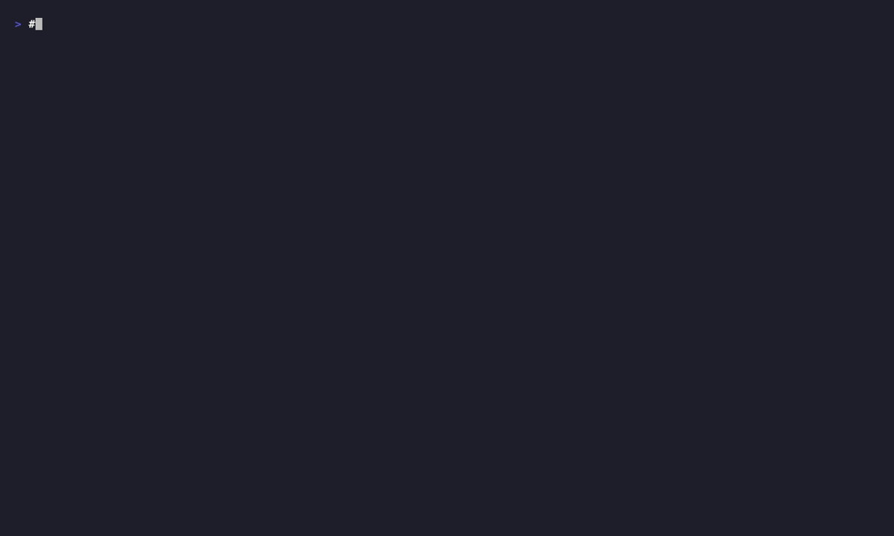

# lecode

> One terminal. Every agent. Every machine.

[](https://github.com/aryateja2106/lecode/actions)
[](LICENSE)
[](https://github.com/aryateja2106/lecode)



## What lecode is (today)

- A Rust daemon that runs on your hardware.
- Spawns any CLI coding agent (Claude Code, Codex, OpenCode …) on demand.
- Streams the agent's stdout back over WebSocket as JSON-RPC `agent.output` notifications.
- 21 tests passing. Apache-2.0.

The daemon exposes a single WebSocket endpoint (`ws://127.0.0.1:6767/ws`) speaking
JSON-RPC 2.0. Live methods: `agent.spawn`, `agent.list`, `agent.stop`, `server.handshake`.

## What lecode is NOT (yet)

- No mobile app.
- No desktop app.
- No remote relay.
- No TypeScript SDK.
- No session persistence (storage crate is a stub).

See [ROADMAP.md](./ROADMAP.md) for the planned path.

## Try it in 60 seconds

Everything below assumes you have Rust ≥ 1.85 installed (`rustup show`).

```bash
cd ~/Projects/lecode
cargo build --workspace          # ~2 min first time
```

**Verify the full flow with the test suite:**

```bash
cd ~/Projects/lecode
cargo test --workspace           # 13 tests — all green
```

The end-to-end test in `crates/lesearch-cli/tests/e2e_spawn_and_stream.rs` starts the
daemon in-process, connects the CLI logic, spawns a test agent, and asserts streamed output.

**Stream a test agent manually** (daemon main wiring lands in v0.1; use the library directly
from your own binary for now, or use the e2e test as a reference):

```bash
cd ~/Projects/lecode

# The CLI binary connects to a running daemon at the address below.
# Start a daemon in your code or test harness, then run:
cargo run -p lesearch-cli -- --provider test --addr ws://127.0.0.1:6767
# → prints lines from the TestProvider to stdout
# → agent ID printed to stderr: "agent: <uuid>"
```

Environment overrides:

```bash
cd ~/Projects/lecode
LESEARCH_ADDR=ws://127.0.0.1:9999 cargo run -p lesearch-cli -- --provider claude
```

> **Note:** `lesearch-cli ls`, `lesearch-cli stop`, and `lesearch-cli daemon status`
> are planned for v0.1 and do not exist yet.

## Architecture (5 crates)

| Crate | Role |
|---|---|
| `lesearch-protocol` | JSON-RPC 2.0 envelope types: `RpcRequest`, `RpcResponse`, `RpcError`, `SpawnParams`, `SpawnResult`, `StreamIds`. Protocol version `0.1.0`, additive-only. |
| `lesearch-daemon` | axum WebSocket server at `/ws`. `AgentManager` registers agents, allocates stream IDs, routes `agent.output` notifications. Entrypoint wiring arrives v0.1. |
| `lesearch-providers` | `AgentProvider` trait. `ClaudeProvider` (subprocess) and `TestProvider` (feature-gated via `test-provider` feature). |
| `lesearch-cli` | Connects to daemon, sends `agent.spawn`, streams `agent.output` notifications to stdout. Flags: `--addr`, `--provider`, `--worktree`. |
| `lesearch-storage` | Session log scaffold (rusqlite). Not yet wired to the daemon. |

`web/` — Next.js landing page at `lesearch.ai`. Apache-2.0.

## For AI coding agents

See [AGENTS.md](./AGENTS.md) — machine-readable command and protocol reference.

## Roadmap

| Milestone | Status |
|---|---|
| v0.0.1 — Rust foundation (daemon + protocol + CLI + providers) | ✅ shipped |
| v0.1 — Daemon main wiring, `agent.list` / `agent.stop`, richer CLI | 🟡 in progress |
| v0.2 — TypeScript SDK (modeled on [pi-ai](https://github.com/badlogic/pi-mono/tree/main/packages/ai)) | 🔴 planned |
| v0.3 — Desktop app (Electron, parity with daemon CLI) | 🔴 planned |
| v0.4 — Mobile app (iOS/Android, QR pairing) | 🔴 planned |
| v0.5 — Relay for remote access (E2E encrypted) | 🔴 planned |

## License

Apache-2.0. Contributions: inbound=outbound. See [CONTRIBUTING.md](CONTRIBUTING.md).

## Related projects in this ecosystem

- `lecoder-mconnect` — iOS/Android client scaffolding (`~/Projects/lecoder-mconnect`)
- `karna` — related Rust agent platform (`~/Projects/karna`)
- `lesearch-website` — archived standalone site (contents now in `web/`)
